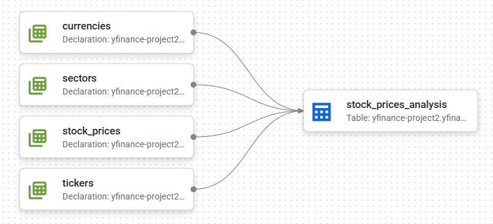

# yfinance-dataform

本リポジトリは、GCP上でDBTのようにDataformを扱うスキル習得を目的として作成しています。

もともとのETLパイプライン（[yfinance-gcp-project2](https://github.com/yamato-aoki/yfinance_gcp_project2)）は Cloud Functions によって実運用が可能な構成ですが、  
本リポジトリではさらに **Dataform を用いて SQLベースでの整備や構造の明示化にも取り組む** ことで、DWH設計やモデリングの実践的理解を深めることを狙いとしています。


## ディレクトリ構成（現状）

```
dataform/
├── definitions/
│   ├── sources/       # BigQuery 上に既存するテーブルを参照（declaration）として定義
│   └── output/        # 分析用に整形・実体化するテーブルを定義
```


---

## 依存テーブルと役割

以下は `stock_prices_analysis` 出力に依存する主要テーブル群とその役割です。

| テーブル名         | 種別        | 説明                                             |
|--------------------|-------------|--------------------------------------------------|
| `stock_prices`      | declaration | 株価の時系列データ（日次）                      |
| `tickers`           | declaration | 銘柄マスタ（ティッカーの属性情報）              |
| `sectors`           | declaration | 業種マスタ（各ティッカーの属する業種）          |
| `currencies`        | declaration | 通貨マスタ（ティッカーごとの通貨情報）          |
| `stock_prices_analysis` | table  | 上記を統合した非正規化ビュー。分析用途に最適化 |


---

## 構成図（イメージ）



---

## 実装予定

- [yfinance_gcp_project2](https://github.com/yamato-aoki/yfinance_gcp_project2) の変換処理 [`transform_to_analytics.py`](https://github.com/yamato-aoki/yfinance_gcp_project2/blob/main/utils/etl/transform_to_analytics.py) にて行っていた **非正規化ビューの生成** を、今後 Dataform 側で置き換え・管理する構成へ移行予定


---

## 作者情報

- 名前：青木 大和（Yamato Aoki）
- 志望職種：データエンジニア
- 注力している領域：データ基盤構築 / ETL / GCP活用 / 再現性ある設計


---

## 注意事項

このリポジトリは学習・ポートフォリオ提出目的で作成されたものであり、商用利用・再配布はご遠慮ください。
